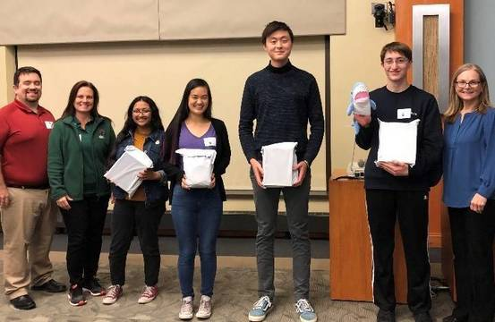

# Welcome to my BLOG

I'm Justin, a cohen high school student.

## Me: im the dude in the middle

I am a student in cohens class. I learn a lot from him. He inspired me to study comp sci. Also emacs is better than vim. 

## brag

1. I graduated high school
2. I took some SAT tests
3. I learned a lot about security in cohen's class
4. blockchain is the solution to everything
5. I used arch linux until everything kept on breaking
6. now i use debian distros like ubuntu rip
7. i tried hackintosh for a bit but it broke just like arch linux
